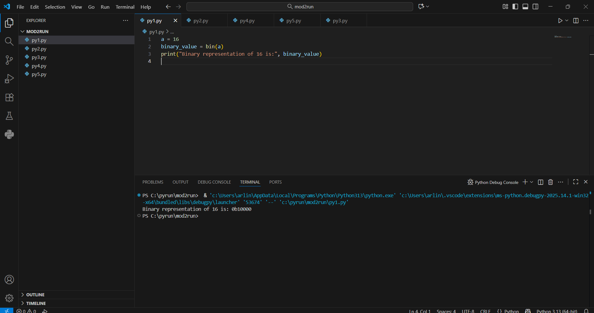

# Built-in Functions -Binary Conversion Using Built-in Functions in Python

## 🎯 Aim
To write a Python program to convert the number **16** into its **binary representation** using built-in Python functions.

## 🧠 Algorithm
1. Assign the value `16` to a variable `a`.
2. Use the built-in `bin()` function to convert the number to binary.
3. Print the result.

## 🧾 Program

```
a = 16
binary_value = bin(a)
print("Binary representation of 16 is:", binary_value)

```
## Output



## Result
The program successfully converts the number 16 into its binary representation using the bin() function.